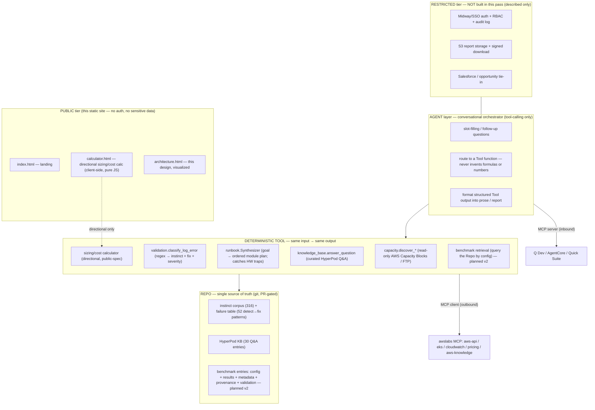

# Benchmark Portal — Technical Design

> **Status:** first-pass design for review. Some components are SHIPPED in
> `agentic-harness` / `cluster_ops` today; others are marked **planned (v2)**.
> Read this alongside [`../docs/MANUAL.md`](../docs/MANUAL.md),
> [`../docs/MCP.md`](../docs/MCP.md), and
> [`../docs/integrations/README.md`](../docs/integrations/README.md).

## 0. The thesis in one paragraph

The product is a **deterministic Tool** (same input → same output, no
hallucination, structured in/out) **wrapped by an Agent** (conversational,
slot-filling, tool-orchestration-only) **backed by a Repo** (one shared
source of truth: real benchmark runs, the instinct corpus, the failure
table). A **Portal** lets people browse the catalog, inspect configs,
generate customer-safe reports, chat with the agent, and download
artifacts. The public tier is read-only and free of any sensitive data; a
restricted tier (auth + RBAC + audit) is described here but **not built in
this pass**.

`agentic-harness` already implements the hard half — the deterministic Tool.
`cluster_ops` is a deterministic capacity-discovery engine, a deterministic
failure classifier, and an empirical-ladder fix dispatcher. This design
shows how those map onto the spec and what the Agent / Repo / Portal layers
add on top.

---

## 1. System architecture



**Trust boundary.** The PUBLIC tier never sees a customer name, a negotiated
price, an account id, or a real benchmark number. The deterministic Tool's
*mutating* verbs (capacity purchase, fix execution) live behind a spend
firewall and a human gate and are **not exposed over the public MCP surface
at all** — that is a structural invariant enforced by a test, not a
convention (see §4 and `../docs/MCP.md`).

---

## 2. Component spec — the deterministic Tool service

The Tool is a set of **pure, structured functions**. Each has a typed input,
a typed output, and is referentially transparent within an AWS account
snapshot (read-only calls reflect live AWS state but the *transform* is
deterministic; the sizing calculator is fully pure).

| Function | Input | Output | Mutating? | Status |
|---|---|---|---|---|
| `discover_capacity` | instance_type, count, duration_hours, region | list of `CapacityOffering{offering_id, instance_type, az, start, end, upfront_fee, currency, kind}` | No (read-only) | **SHIPPED** (`cluster_ops/capacity/purchase.py`) |
| `classify_failure` | log text | list of `ErrorPattern{instinct_id, severity, likely_fix, description}` | No | **SHIPPED** (`cluster_ops/validation/error_patterns.py`) |
| `plan_cluster` | goal sentence | ordered `Module[]` + warnings (catches the B200 8-vs-16 EFA-NIC trap at plan time) | No (dry-run) | **SHIPPED** (`cluster_ops/runbook/synthesizer.py`) |
| `ask_hyperpod` | question, top_k | KB entries with do / do-not / depends tiers + source + confidence | No | **SHIPPED** (`cluster_ops/knowledge_base.py`) |
| `taxonomy` | — | live corpus inventory by kind / layer / substrate / workload / instance-type | No | **SHIPPED** |
| `size_cluster` | model_params_B, workload, gpu_type, instance_count, precision | total GPUs, aggregate VRAM, memory-fit verdict, TP/PP/DP suggestion, directional on-demand cost | No (pure) | **SHIPPED on public site** (`assets/calculator.js`); a server-side typed version is **planned (v2)** |
| `query_benchmark` | config selector (model, gpus, parallelism, framework) | matching benchmark entries from the Repo with provenance + validation status | No | **planned (v2)** |
| `purchase_capacity` | offering_id, confirm_token | `PurchaseResult` | **YES** — 3-factor firewall, never on public MCP | SHIPPED in-process, **never exposed remotely** |

**Determinism contract.** For the pure functions (`size_cluster`,
`classify_failure`, `plan_cluster`), identical input yields byte-identical
output. This is the anti-hallucination property: the Agent can phrase the
answer however it likes, but the *numbers and the classification* come from
the Tool, not from a language model. The failure classifier is a compiled
regex table (52 patterns), not a prompt.

---

## 3. Component spec — the Benchmark Repo (source of truth)

The Repo is a git repository. Two parts already exist; the benchmark-entry
part is the **v2 addition**.

### 3a. Shipped today

- **Instinct corpus** — 316 atomic instincts, each with `kind`
  {pattern, gotcha, style, learning, correction} and an `applies_to`
  qualifier {substrate, layer, workload, project_type, instance_type}.
  Stored in `cluster_ops/instincts_seed/`. Contribution is by PR following
  the atomic-instinct schema (see `../CONTRIBUTING.md`).
- **Failure table** — 52 compiled detect→fix patterns
  (`cluster_ops/validation/error_patterns.py`). New patterns are *mined*
  from session logs, then promoted by PR.
- **HyperPod KB** — 30 curated Q&A entries with positive / negative /
  neutral tiers and a source + confidence on every entry.

### 3b. Benchmark entry schema (planned v2)

Each benchmark run is one JSON document under `benchmarks/<id>.json`,
PR-contributed, validated by a CI gate before merge:

```jsonc
{
  "id": "bench-2026-...-<short-hash>",
  "config": {
    "model": "llama-3-8b",            // public model name only
    "workload": "inference",          // train | inference | finetune
    "gpu_type": "H100",               // public part name
    "instance_type": "p5.48xlarge",   // public AWS instance type
    "instance_count": 2,
    "gpus_total": 16,
    "parallelism": { "tp": 8, "pp": 1, "dp": 2 },
    "precision": "bf16",
    "framework": "vllm",              // vllm | trtllm | nemo | fsdp | nccl-tests
    "framework_version": "0.x.y"
  },
  "results": {                         // the REAL measured numbers
    "metric": "tokens_per_sec",        // or busbw_gbps, ms_p50, etc.
    "value": 0.0,
    "unit": "tok/s",
    "secondary": { "ttft_ms_p50": 0.0, "throughput_req_s": 0.0 }
  },
  "metadata": {
    "run_date": "2026-..-..T..:..:..Z",
    "region": "us-east-2",
    "node_count": 2,
    "harness": "aiperf | nccl-tests | custom"
  },
  "provenance": {
    "commit": "<sha>",                 // exact code that produced this
    "image_digest": "sha256:...",      // exact container
    "command": "redacted-safe command line",
    "audit_ref": ".claude-sessions/<run_id>/"  // links to the audit trail
  },
  "validation": {
    "status": "validated | provisional | rejected",
    "validator": "<reviewer or CI gate id>",
    "gates_passed": ["fabric-active", "no-tcp-fallback", "reproduced-2x"],
    "notes": "..."
  }
}
```

**Why provenance + validation are first-class fields:** a benchmark number
with no commit, no image digest, and no validation status is a rumor. The
Repo's value proposition is that every number is reproducible and graded.
This mirrors how the instinct corpus already enforces 100%
retrievable / actionable / attributed.

**CI validation gate (v2):** a PR adding a benchmark entry fails unless
(a) the schema validates, (b) `provenance.commit` and `image_digest` are
present and non-placeholder, (c) `validation.status` is set by someone other
than the contributor (separation of authoring and approval — the same
two-pass discipline the harness uses), and (d) no sensitive-data linter hit
(customer names, account ids, internal hostnames).

---

## 4. Component spec — the Agent layer (tool-orchestration-only)

The Agent is a conversational front end (Amazon Nova / Bedrock AgentCore /
any agent framework). Its **contract** is the load-bearing part:

1. **It never invents formulas or benchmark numbers.** Every number it
   emits must be the return value of a Tool function. If no Tool can answer,
   it says so — it does not estimate from its own weights.
2. **It is slot-filling.** Missing inputs → ask a follow-up question
   ("which GPU type?", "train or inference?") rather than guessing a
   default silently.
3. **It routes, formats, and cites.** It picks the right Tool function,
   passes structured arguments, and renders the structured result into prose
   or a report — always citing the source (instinct id, KB entry id,
   benchmark id, or "directional public-spec estimate").
4. **It cannot mutate.** The Agent's tool surface is the **read-only MCP
   server** (`cluster-ops-mcp`). There is no `purchase` and no `execute`
   tool on that surface — enforced by
   `tests/test_cluster_ops_mcp.py::test_no_mutating_tool_is_exposed`, which
   fails the build if a mutating verb is ever added. Spend and cluster
   mutation stay behind the in-process human gate.

This is the same "advise vs execute" boundary the product already ships:
the MCP/agent surface advises (plan, classify, discover, answer); the
in-process, human-gated path executes.

---

## 5. Component spec — the reporting pipeline

```
Tool output (structured)
   → Agent assembles a report object {summary, config, results, provenance, caveats}
   → renderer produces TWO artifacts:
       (a) executive summary  — customer-safe prose, directional/validated labels
       (b) technical artifact — exact config + commit + image digest + command
   → (v2) store to S3, return a signed download link; log to audit
```

- **Executive summary** is customer-safe: no internal pricing, no account
  ids; every quantitative claim is labeled either **"validated benchmark"**
  (backed by a Repo entry) or **"directional estimate"** (from the
  public-spec calculator).
- **Technical artifact** is the reproducibility backing: the exact commit,
  image digest, and command so a third party can re-run it.
- **MVP** renders both as Markdown/HTML inline. **v2** persists to S3 with a
  signed link and writes an audit record.

---

## 6. Governance & contribution

| Concern | Mechanism | Status |
|---|---|---|
| Add an instinct | PR editing `instincts_seed/known_gotchas.json` against the atomic schema with `applies_to` | SHIPPED |
| Add a failure pattern | mined from logs → PR into `error_patterns.py` | SHIPPED |
| Add a benchmark entry | PR adding `benchmarks/<id>.json` → CI schema + provenance + sensitive-data gates → human validator sets `validation.status` | planned (v2) |
| Coverage ratchet | a floor that never lowers (retrievable / actionable / attributed all 100%); enforced by a pre-commit hook + test | SHIPPED for instincts |
| Separation of authoring & approval | contributor cannot self-validate their own benchmark entry | planned (v2) |
| Sensitive-data firewall | linter rejects customer names / account ids / internal hostnames in any public-facing entry | planned (v2) |

---

## 7. How `agentic-harness` / `cluster_ops` ALREADY implements the deterministic Tool

This is the part worth being concrete about — the spec's "deterministic
tool" half is not aspirational, it ships:

| Spec requirement | Already implemented by |
|---|---|
| "Same answer every time; structured in/out" | `classify_log_error()` is a compiled regex table → list of dataclasses. Pure. |
| "Prevents hallucination" | The failure classification and the module plan come from data + code, not a prompt. The Agent can't override the instinct id. |
| "Benchmark retrieval engine" (partial) | `ask_hyperpod` retrieves curated answers with confidence + source today; `query_benchmark` over real runs is the v2 generalization. |
| "Capacity-aware" | `discover_capacity_blocks` / `discover_ftp_offerings` — read-only, live AWS, structured `CapacityOffering`s. |
| "Failure-aware" | the 52-pattern table maps a log signature → instinct → severity → codified fix. |
| "Plan-time correctness" | `Synthesizer` catches the B200 8-vs-16 EFA-NIC trap **before** any apply. |
| "Spend firewall / non-mutating agent surface" | 3-factor purchase gate (`CLUSTER_OPS_PROD=1` + `confirm==offering_id` + out-of-band `CLUSTER_OPS_PURCHASE_TOKEN`); MCP server is structurally non-mutating. |

The new work for the portal is the **Repo's benchmark-entry half** and the
**Portal UI** — the deterministic engine, the failure-awareness, the
capacity-awareness, and the safety boundary already exist.

---

## 8. Integrations

| Integration | Direction | What it does | Status |
|---|---|---|---|
| **MCP server** (`cluster-ops-mcp`) | inbound — others call us | Q Developer CLI, Bedrock AgentCore Gateway, Quick Suite Desktop register our read-only tools (`ask_hyperpod`, `classify_failure`, `plan_cluster`, `discover_capacity`, `list_failure_signatures`, `taxonomy`) | SHIPPED (stdio); remote HTTPS transport is the one open follow-up |
| **MCP client** | outbound — we call AWS | `cluster_ops.mcp.client` calls awslabs servers: `aws-api`, `eks`, `cloudwatch`, `pricing`, `aws-knowledge` | SHIPPED |
| **Amazon Q Developer** | inbound | wrap the CLI headless (`q chat --no-interactive --trust-all-tools`) with our `mcp.json` | SHIPPED (CLI); no public SDK for the coding agent |
| **Bedrock AgentCore** | inbound | Gateway `CreateGatewayTarget` re-hosts our MCP tools; `bedrock-agentcore` boto3 client invokes runtime | SHIPPED path; needs remote HTTP transport for Gateway |
| **Amazon Quick Suite** | inbound | Desktop app registers our stdio server; cloud Quick Agent needs remote HTTPS + OAuth | partial — desktop yes, cloud needs the transport |
| **Slack** | both | live bridge for status relay (hour-4 + hour-8 consolidated updates); command router | SHIPPED (bridge), selective channel mining |
| **S3 report storage** | outbound | persist executive + technical report artifacts, signed download | planned (v2) |
| **Salesforce / opportunity tie-in** | outbound | attach a generated report to an opportunity | planned (v2) |

Every claim above is backed by
`analysis/research/q-agentcore-programmatic-access-2026.md` (verified against
botocore service models + the awslabs/mcp repo).

---

## 9. MVP vs v2 scope split

**MVP (this pass + a thin server):**
- Public static site: landing, directional calculator, architecture page.
- Deterministic Tool functions: discover / classify / plan / ask / taxonomy
  / size — all shipped.
- Read-only MCP server for agent integration — shipped.
- Reports rendered inline (Markdown/HTML).

**v2:**
- Benchmark-entry Repo (`benchmarks/*.json`) with the schema in §3b + CI
  validation gate.
- `query_benchmark` Tool function + benchmark catalog browse in the portal.
- Restricted portal tier: Midway/SSO auth, RBAC, audit log.
- S3 report persistence with signed download.
- Remote Streamable-HTTP MCP transport (unlocks AgentCore Gateway + cloud
  Quick Suite).
- Salesforce / opportunity tie-in.

---

## 10. How we're better than the reference calculator

The reference is the aws-do-eks "disagg-calculator": a single `index.html`
with the formulas in client-side JS, no backend, no failure-awareness, no
catalog. We keep its best property (deterministic, client-side, no backend
to misconfigure) and go broader on every axis:

| Axis | Reference disagg-calculator | This portal |
|---|---|---|
| Scope | one calculation (disagg sizing) | sizing **+** capacity discovery **+** failure classification **+** plan synthesis **+** curated Q&A |
| Failure-awareness | none | 52 compiled detect→fix patterns; paste a log, get the codified fix |
| Capacity-awareness | none | live read-only Capacity Block / FTP offering discovery |
| Reproducibility | a number on a page | every real benchmark carries commit + image digest + validation status |
| Hallucination control | implicit (it's just JS) | explicit contract: Agent never emits a number a Tool didn't return |
| Integration | standalone page | MCP server (inbound) + MCP client (outbound) into the AWS agent ecosystem |
| Layers | one layer (sizing math) | L0→L9 (primitive → knowledge); mass at L4.5 build/CI and L6 OS/infra where bring-ups actually break |
| Honesty | unlabeled estimates | every number labeled "directional" or "validated benchmark" |

The public calculator on this site is deliberately *directional only* — it
exists to demonstrate the deterministic-tool pattern with public-spec
numbers, not to replace a real benchmark. The real numbers live in the
PR-gated Repo, behind validation.

---

## 11. Open questions for the human

1. **Agent framework:** Amazon Nova via Bedrock, AgentCore-hosted, or a
   thin Claude-based agent that calls the existing MCP server? The Tool /
   Repo design is framework-agnostic; the choice affects only the Agent
   layer in §4.
2. **Public hosting:** GitHub Pages (matches the dmvevents reference) vs S3
   static hosting vs CloudFront. The static site is portable to any of them.
3. **Benchmark seeding:** which real, customer-safe runs seed the v2 Repo
   first? (NCCL bandwidth on p5, an open-model inference throughput on
   p5en?) Need confirmation that the chosen runs carry no sensitive data.
4. **Calculator formula sign-off:** the directional formulas in §3 of
   `assets/calculator.js` are public-spec heuristics. Do you want a domain
   reviewer to sign off on the parallelism heuristic before this goes
   public, even labeled "directional"?
